<!-- Los SVG de assets/ se generan con: python scripts/build.py -->

  

  

  

---

### `$ whoami`

  

---

<h3 align="center"><code>$ cat tech-stack.yaml</code></h3>

<table>
  <tr>
    <td colspan="2"><code>samael@index:~$ cat tech-stack.yaml</code></td>
  </tr>
  <tr>
    <td width="50%">
      <code>├─ ◆ frontend:</code>  
       
      TypeScript · JavaScript · React · Next.js · Tailwind
    </td>
    <td width="50%">
      <code>├─ ◇ backend_data:</code>  
       
      Node.js · Prisma · PostgreSQL
    </td>
  </tr>
  <tr>
    <td>
      <code>├─ ⚡ automation_ai:</code>  
      
       
      n8n · Claude / IA · APIs
    </td>
    <td>
      <code>└─ ▲ deploy_tools:</code>  
       
      Vercel · Git · GitHub · VS Code
    </td>
  </tr>
  <tr>
    <td colspan="2"><code>status: ready</code> · <code>environment: production</code></td>
  </tr>
</table>

---

### `$ ls ~/projects`

| Proyecto | Qué es | Stack |
|---|---|---|
| **Velas Luze** | E-commerce de velas artesanales con panel de administración, auth propia, catálogo y carga de imágenes. | Next.js · React · TypeScript · Prisma · PostgreSQL · Tailwind |
| **Automatizaciones con IA** | Flujos que conectan herramientas y modelos de IA para ahorrar trabajo repetitivo en marketing y ventas. | n8n · IA · APIs · Node.js |

---

### `$ samael --signals --all`

  

---

### `$ git log --stats`

  
  

---

### `$ connect --socials`

  

Hecho con 💚 y mucho café desde Colombia · <code>@samael-index</code>

